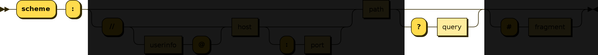

KV is a URI scheme exclusively for storing data. Here's what it looks like:

```
kv:?roses=red&violets=blue
```

URI schemes are originally designed to [point to resources](https://en.wikipedia.org/wiki/List_of_URI_schemes). The term "URI (Universal Resource Identifier)" itself implies that URIs are meant to be used for referencing resources.

KV URI Scheme is the opposite. KV is not for pointing to a resource location. There is no location because the whole point of KV is that there is no location. It's explicitly for storing data within the URI itself, not tied to any resource.

---

# Specification

A KV URI is a fully compliant subset of the [RFC 3986](https://tools.ietf.org/html/rfc3986) (or, the URI as we know it). Here's the general structure of a URI:


<br>

A KV URI scheme is only interested in the **"query"** part of the URI specification:



Here's an example:

```
kv:?<key0>=<val0>&<key1>=<val1>&...
```

1. **"kv" scheme:** A KV URI starts with "kv:?". This "kv:?" prefix ensures that machines can easily detect kv encapsulated data with minimum computation. 
2. **Single line:** because kv is designed for key-value pairs (one dimensional data structure), everything fits into a single line. This means it can be easily embedded anywhere, such as a CSV cell, hypertext content, or can be used in a command line program execution.
3. **Everything is a string:** To avoid verbosity introduced by double quotes, kv makes a tradeoff. Everything is a string. When other data types need to be used, they can be interpreted on an application level.

---

# Why?

The idea for KV came while trying to find a way to create a portable key-value notation that can be easily embedded into an HTML document, just like a URI, but without referencing a specific resource.

The requirements were as follows:

1. **Human Readable:** Humans should be able to easily make sense of what's stored inside.
2. **Concise**: must be as concise as possible (JSON is not concise enough just for storing key-values because of double quotes, brackets, and multiple data type support)
3. **Embeddable:** Must be easily embeddable into any context such as command line, CSV, or as inline content.
4. **Machine Processable:** No reinventing the wheel. Must be able to use existing tools to process the data.
5. **Machine Detectable:** Machines should be able to easily detect the format and extract key value pairs with zero computation. (JSON is not "machine detectable" because it is impossible to know whether a snippet of text is JSON until you try to parse it).

Unfortunately, there was no existing standard that met all these requirements.

Fortunately, there was one widely adopted standard we could repurpose to serve the purpose: The URI system.

---

# Usage

KV can be used in various scenarios:

<br>

## 1. Self-contained portable data bundle

Self contained data bundles can be powerful because they are portable. Because you do not need a special software to interpret the data, the data can be easily shared and processed across multiple platforms and systems.

### 1.1. Digital Signature Bundle

To verify a digital signature, you need the original data, the sender public key, and the signature itself. These three attributes may be expressed using a KV URI:

```
kv:?pub=<public key>&sig=<signature>&data=<original data>
```

A parser may parse above URI into the following variables:

```
pub := <public key>
sig := <signature>
data := <original data>
```

and then verify the authenticity through `ECDSA.verify(pub, sig, data)`

### 1.2. Asymmetric Encryption Bundle

We could encrypt a message and bundle it into a single self-contained KV URI. In order to decrypt an encrypted message, the sender may attach the receiver's public key with which he has encrypted the message. Both the encrypted message and the public key may be included in a KV URI.

```
kv:?pub=<public key>&encrypted=<encrypted data>
```

A parser may parse the URI 

```
pub := <public key>
encrypted := <encrypted data>
```

The owner of the matching private key may scan through all the KV URIs to find the ones that are relevant to them (by filtering for public key) and decrypt the data

<br>

## 2. Inline Embed

The power of KV is in its human readability and embeddability. Because KV is literally just a URI, it can be embedded anywhere a URI can be embedded. This means anywhere from a CSV document to an HTML document to a database entry.

```
<html>
<body>
  <p>Here's a signed message: <a href="kv:?pub=XXX&sig=SSS&data=DDD">Verify</a></p>
</body>
</html>
```

It's also easily machine detectable and processable. To find all kv datasets in an HTML document, you only need to run:

```
let kvs = []
document.querySelectorAll("a[href^='kv']").forEach((el) => {
  kvs.push(el.getAttribute("href"))
})
console.log("all kv attributes: ", kvs)
```

<br>

## 3. Works Anywhere

KV is literally just a URI. Therefore you can parse it using any URI parser, including the native browser URI parser. For example:

```
const uri = "kv:?roses=red&violets=blue"
const u = new URL(uri)
u.searchParams.forEach((k, v) => {
  console.log(k, v)
})
```

---

# FAQ

## 1. Why a new URI scheme?

It is true that we may be able to achieve the same result using existing URI schemes, such as http. For example:

```
http://?roses=red&violets=blue
```

But this is not what HTTP was designed for (it's designed for pointing to hypertext resources). And same goes for other URI schemes like FTP, IMAP, DNS, etc. We need a generic scheme to store Key-Value pairs inside a URI.

---
